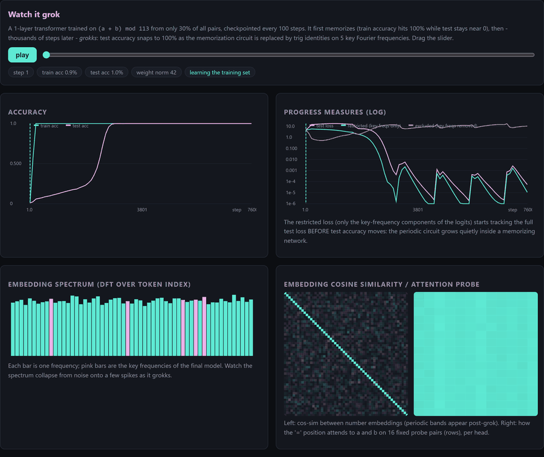
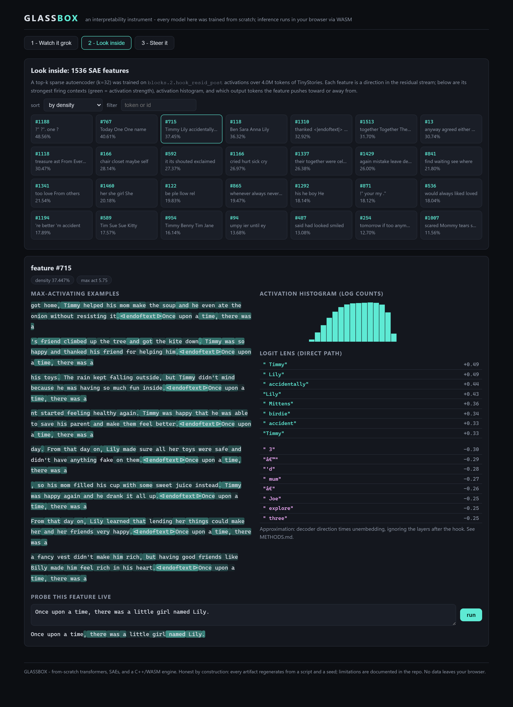
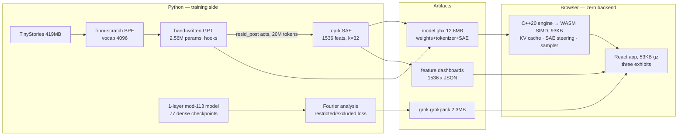

<div align="center">

# GLASSBOX

### an interactive interpretability instrument

**Train a transformer. Catch it grokking. Dissect its features. Steer its mind.**
**All from scratch — and all running live in your browser.**

[**▶ Open the live demo**](https://vineetsista.github.io/glassbox/)

[](https://github.com/vineetsista/glassbox/actions/workflows/ci.yml)
[](https://vineetsista.github.io/glassbox/)
[](engine/)
[](docs/BENCHMARKS.md)
[](LICENSE)



*7,600 training steps in four seconds: watch a transformer abandon its lookup table
and discover trigonometry. Every frame is a real checkpoint from a real training run.*

</div>

---

Interpretability tools are usually demos **about** models, running on someone
else's weights, behind someone else's API. GLASSBOX is the whole stack, owned
end to end:

- a **transformer, tokenizer, and training loop written from scratch** (PyTorch used only for tensors/autograd — no HuggingFace, no TransformerLens, no nanoGPT),
- a **sparse autoencoder** that opens the model up into 1,536 inspectable features,
- a **replication of the grokking → Fourier-circuit result** (Power et al. 2022, Nanda et al. 2023), verified quantitatively *on these weights*,
- and a **hand-rolled C++20 inference engine** — zero dependencies, its own weight format, its own BPE runtime — compiled to 93 KB of WASM SIMD so the entire instrument runs client-side. No backend. No telemetry. Your prompts never leave the tab.

The C++ engine is held to the PyTorch implementation by CI at a tolerance of
`1e-3` on logits. Measured deviation: **`1.8e-07`**.

## The three exhibits

### 1 · Watch it grok

A 1-layer transformer learns `(a + b) mod 113` from just 30% of all pairs.
By step 200 it has memorized its training set (train accuracy 100%, test ~6%).
For two thousand steps, nothing seems to happen. Then test accuracy snaps to
100% — and the instrument shows you *why*: the embedding spectrum collapses
onto five Fourier frequencies `{9, 27, 40, 43, 45}` as a lookup table is
replaced by trig identities. Scrub through all 77 checkpoints yourself.

The subtle part (bottom-left of the GIF above): the **restricted loss** — the
model evaluated through *only* its key-frequency components — starts tracking
test loss *before* accuracy moves. The general circuit grows quietly inside a
memorizing network, invisible to top-line metrics. That is the whole case for
interpretability, in one chart.

**Verified, not narrated** (`python -m grok.analyze`, [findings.json](docs/figures/grok/findings.json)):
90.6% of embedding power lives in those 5 of 56 frequencies; 90% of MLP
neurons lock onto a single frequency; keeping only key-frequency logit
components gives *better* test loss (1.1e-5) than the full model (5.4e-5),
while deleting them destroys it (10.7).

### 2 · Look inside



Every one of the 1,536 top-k SAE features, browsable: token-level heatmaps of
its strongest firing contexts in real stories, its activation histogram, and
a logit-lens readout of what it pushes the model to say. Then the part a
static dashboard can't do: **type your own sentence and watch the feature
fire on it, token by token** — the actual model, running in your browser.

### 3 · Steer it

Same prompt, same seed, two generations — the right one with your edits
applied to the residual stream mid-network. This is what happened when a
Lily-associated feature was amplified 4× (seed 1, reproducible in the demo):

> **baseline:** Once upon a time, there was a little **mouse** named Benny. Benny loved to eat carrots and play in the **forest**. One day, Benny's mom found a small toy...
>
> **steered:** Once upon a time, there was a little **bear** named Benny. Benny loved to eat carrots and play in the **woods**. ... *"Because it's not deep so good," **said Lily**.*

The edit injected Lily into a story she was never in — as a speaking
character. Ablation (×0) works too. Edits are delta-based, so the SAE's
reconstruction error is never injected: what changes is attributable to the
feature you touched, and clearing edits restores the baseline bit-for-bit
(that's a unit test).

## How it fits together



Parity is enforced where the two worlds meet: committed fixture vectors pin
the C++ engine to PyTorch (logits ≤ 1e-3, measured 1.8e-07), the C++ BPE
scanner to the Python trainer (exact ids), and the C++ SAE to the training
code (≤ 1e-4) — in CI, on every push, with training never running in CI.

## What "from scratch" means, precisely

| Layer | Hand-written here | Deliberately used |
|---|---|---|
| LM architecture | attention, RoPE, RMSNorm, GELU MLP, tied embeddings, the `HookPoint` observe/intervene system | `torch.Tensor`, autograd, `AdamW` |
| Tokenizer | byte-level BPE **trainer** and codec; 50MB → vocab 4096 in 46s | Python stdlib only |
| Grokking | 1-layer model, full-batch training, 2D-DFT restricted/excluded progress measures | `torch.fft` |
| SAE | top-k architecture, dead-feature resampling, activation cache, dashboard baker | `Adam`, numpy memmap |
| Inference engine | **everything** — JSON parser, GBX loader, BPE runtime, fp32 kernels, KV cache, top-k SAE, xorshift sampler | C++20 stdlib; Catch2 (tests only) |
| Web app | grokpack binary parser (incl. fp16 decode), canvas line/bar/heatmap renderers, engine bindings | React, Vite, TypeScript |
| Data | — | TinyStories via `datasets` (download only) |

## Numbers, with receipts

Built and measured on a single **9-watt laptop CPU** (i7-1250U, no GPU).
Every figure regenerates from a script and a seed — sources in
[docs/BENCHMARKS.md](docs/BENCHMARKS.md).

| | metric | receipt |
|---|---|---|
| LM | 2,557,632 params · 49M tokens · val loss **1.921** | `runs/lm_s/log.csv` |
| Grokking | memorized step ~200 → grokked step ~3000 | `runs/grok/log.csv` |
| Fourier circuit | 90.6% emb power in 5 freqs · 90% single-freq neurons | `grok/analyze.py` |
| SAE | FVU **0.098** · **0 dead** features of 1536 | `runs/sae_l2/log.csv` |
| Engine parity | max logit diff **1.8e-07** (contract 1e-3) | `engine/tests/`, CI |
| Engine speed | 1,398 tok/s native · ≥340 tok/s in-browser | `runs/engine_bench.txt` |
| Tests | 21 Python + 12 C++ cases (750 assertions), 4 CI jobs | `.github/workflows/ci.yml` |

Unedited, fixed-seed model output lives in [docs/SAMPLES.md](docs/SAMPLES.md)
— the gallery is generated by script and never curated.

## Run it yourself

```bash
git clone https://github.com/vineetsista/glassbox && cd glassbox
python -m venv .venv && .venv/bin/pip install torch --index-url https://download.pytorch.org/whl/cpu
.venv/bin/pip install -r requirements-dev.txt

# data -> tokenizer -> pack        (~15 min)
.venv/bin/python scripts/fetch_tinystories.py
.venv/bin/python scripts/train_tokenizer.py --corpus data/tinystories_train.txt
.venv/bin/python scripts/pack_data.py --corpus data/tinystories_train.txt \
    --tokenizer data/tokenizer.json --out data/tinystories.bin

# the two training runs            (one laptop-night, resumable)
bash scripts/launch_lm.sh 6000 8
.venv/bin/python -m grok.train_grok --run runs/grok --steps 8000

# everything downstream, unattended (waits for the LM, then chains
# SAE cache -> train -> dashboards -> exports -> site)
bash scripts/post_lm_pipeline.sh

# engine: native tests + wasm
cmake -S engine -B engine/build -G Ninja && ninja -C engine/build && ctest --test-dir engine/build
emcmake cmake -S engine -B engine/build-wasm -G Ninja && ninja -C engine/build-wasm
bash scripts/build_site.sh   # -> web/dist, serve statically
```

Seeds are fixed (LM 1337, grok 999, SAE 4242) and checkpoints resume exactly,
optimizer and RNG state included — a `kill -9` costs you nothing.

## Reading map

| | |
|---|---|
| [docs/WALKTHROUGH.md](docs/WALKTHROUGH.md) | the guided ten-minute tour of the exhibits |
| [docs/METHODS.md](docs/METHODS.md) | precise definitions — architecture, our restricted/excluded losses, steering semantics, known divergences |
| [docs/GBX_FORMAT.md](docs/GBX_FORMAT.md) | the weight-bundle format spec |
| [docs/BENCHMARKS.md](docs/BENCHMARKS.md) | every number and its source |
| [docs/INTERVIEW_DRILL.md](docs/INTERVIEW_DRILL.md) | the hard questions, answered only as far as the data allows |
| [DECISIONS.md](DECISIONS.md) | the build log — every judgment call, including the mistakes |
| [phase_reports/](phase_reports/) | what each phase did, found, and broke |

## Limitations — read this before being impressed

- **The LM is tiny and undertrained.** 2.56M params, half an epoch, val loss
  1.92. It writes grammatical TinyStories-flavored text with regular logical
  derailments ([docs/SAMPLES.md](docs/SAMPLES.md) shows them unedited). Nothing
  here says anything about frontier models except by methodological analogy.
- **SAE features at this scale are low-level** — names, dialogue markers,
  positions, syntax. Some are dense or uninterpretable; the dashboards show
  them anyway.
- **Steering is a nudge, not a dial.** Effects are real and seed-reproducible
  but noisy. The logit-lens panel is a direct-path approximation and labeled
  as such in the UI.
- **Our grokking progress measures are simplified** (2D DFT of the logit grid,
  not Nanda et al.'s internal decomposition) — coarser, model-agnostic;
  definitions in METHODS.md §3.
- **One seed each.** The compute budget bought one LM run, one grok run, one
  SAE run. Every number is a point estimate with no error bars.
- **C++/Python tokenizer divergence on exotic unicode whitespace** exists and
  is documented (METHODS.md §2); it is unreachable for the training
  distribution.

## Lineage

The grokking setup follows **Power et al. 2022** (*Grokking: Generalization
Beyond Overfitting*) and the Fourier-circuit analysis follows **Nanda et al.
2023** (*Progress Measures for Grokking via Mechanistic Interpretability*),
re-implemented and re-measured from scratch. The SAE follows the top-k
formulation of **Gao et al. 2024** with Anthropic-style dead-feature
resampling. Training data is **TinyStories** (Eldan & Li 2023). All analysis
code here is original.

<div align="center">

MIT · built solo on a 9W laptop · every claim regenerates from a script and a seed

</div>
